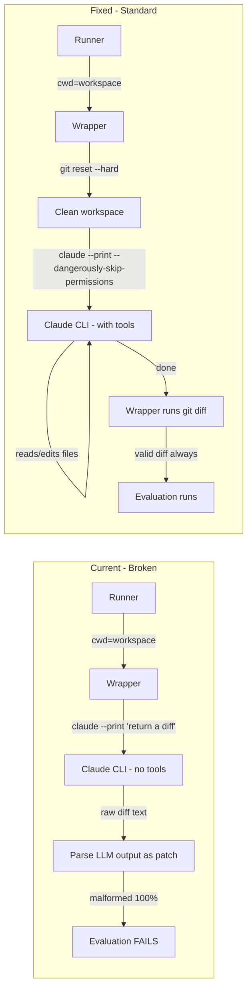

# Fix Claude Agent to Use Agentic Mode with Workspace Access

## Problem

The current `claude_code_wrapper.py` runs `claude --print` and asks the LLM to _output_ a raw unified diff. This fails 100% of the time (9/9 attempts) because LLMs cannot reliably produce syntactically valid diff hunk headers. The standard SWE-bench approach is to let the agent edit files in the workspace, then capture changes via `git diff`.

## Root Cause



## Key Insight

`claude --print` mode **does support tool use** (Bash, Edit, Read, Grep, etc.). The `--print` flag just means non-interactive output, not "no tools." We need to:

1. Add `--dangerously-skip-permissions` so Claude can use tools without interactive prompts
2. Change the prompt from "return a diff" to "edit files to fix the bug"
3. After Claude finishes, capture changes via `git diff`

## Existing Architecture (unchanged)

- The runner in `[src/benchkit/swebench/agents/base.py](src/benchkit/swebench/agents/base.py)` already launches the wrapper subprocess with `cwd=str(context.workspace_root)` (line 119)
- The workspace path is also included in the JSON payload as `run.workspace_root`
- The runner parses the wrapper's stdout JSON: `{"patch": "...", "metadata": {...}}`
- The evaluation pipeline, appendix generation, and all downstream code remain unchanged

## Changes

### 1. Modify `[scripts/agents/common.py](scripts/agents/common.py)` - Prompt and git helpers

**Change `render_task_prompt`** to produce an agentic prompt instead of a "generate a diff" prompt:

- Remove the "Output constraints: Return ONLY a valid unified git diff patch" block
- Replace with instructions to investigate and edit files in the workspace
- Keep instance metadata (ID, repo, commit, language, issue, metadata, prompt_context) intact
- New prompt structure:

```
You are {wrapper_name} running in benchmark mode.
You have access to a workspace containing the source code of {repo} at commit {base_commit}.

Task: Investigate and fix the following issue by editing files directly in the workspace.

Instructions:
- Read the relevant source files to understand the code.
- Identify the root cause of the issue described below.
- Edit the necessary files to fix the bug.
- Do not commit your changes; just leave the edited files in place.

Instance ID: {instance_id}
Repository: {repo}
Base commit: {base_commit}
Language: {language}

Issue:
{problem}

Additional metadata:
{extra_notes}
```

**Add `reset_workspace(workspace: Path, git_bin: str)` helper** to clean workspace state before each attempt:

- Run `git reset --hard HEAD`
- Run `git clean -fd`
- Both with `cwd=workspace`

**Add `capture_workspace_patch(workspace: Path, git_bin: str)` helper** to extract changes after agent finishes:

- Run `git diff` with `cwd=workspace`
- Return stdout (guaranteed-valid diff or empty string)

### 2. Modify `[scripts/agents/claude_code_wrapper.py](scripts/agents/claude_code_wrapper.py)` - Main wrapper logic

**Before running Claude:**

- Call `reset_workspace()` to ensure a clean starting state (critical for multi-attempt runs since workspaces are reused)

**Change command construction:**

- Keep `--print` and `--output-format json` (for structured output with usage metrics)
- Add `--dangerously-skip-permissions` (required for non-interactive tool use)
- Keep `--model` flag
- Keep `CLAUDE_EXTRA_ARGS` support
- The prompt is still passed as the last CLI argument (this works fine)

**After Claude finishes:**

- Run `capture_workspace_patch()` to get the actual `git diff` from the workspace
- Use this as the primary patch source (`patch_source = "workspace_git_diff"`)
- Fall back to parsing Claude's text output via `extract_git_patch()` only if workspace has no changes
- Parse Claude's JSON output for usage metrics as before (this still works since `--output-format json` returns usage data)

**Handle non-zero exit codes differently:**

- Currently, any non-zero exit code is a fatal error
- With agentic mode, Claude might exit non-zero but still have made valid edits
- Check `git diff` even on non-zero exit; only fatal if both claude failed AND no workspace changes

### 3. Modify `[scripts/agents/cursor_wrapper.py](scripts/agents/cursor_wrapper.py)` - Same pattern

Apply the same changes as Claude wrapper:

- Add `--dangerously-skip-permissions` (Cursor agent CLI uses similar flags)
- Reset workspace before starting
- Capture `git diff` after agent finishes
- Cursor wrapper already passes `--workspace` which is correct

### 4. No changes needed to

- `[src/benchkit/swebench/agents/base.py](src/benchkit/swebench/agents/base.py)` - already sets cwd, parses `{"patch": ..., "metadata": ...}`
- `[src/benchkit/swebench/runner.py](src/benchkit/swebench/runner.py)` - no changes needed
- `[src/benchkit/swebench/workspace.py](src/benchkit/swebench/workspace.py)` - no changes needed
- Evaluation pipeline, appendix generation, configs - all unchanged
- The `{"patch": "...", "metadata": {...}}` contract between wrapper and runner is preserved

## Risk Mitigation

- **Workspace pollution between attempts**: Solved by `git reset --hard` + `git clean -fd` at the start of each wrapper invocation
- **Claude runaway costs**: Can be controlled via existing `CLAUDE_EXTRA_ARGS` env var (e.g. `--max-turns 50 --max-budget-usd 5`)
- **Backwards compatibility**: The config files don't change. The prompt changes inside the wrapper. Old runs with malformed patches are preserved as-is.
- **Fallback**: If workspace `git diff` is empty but Claude's text output contains a diff, we still extract it (graceful degradation)
