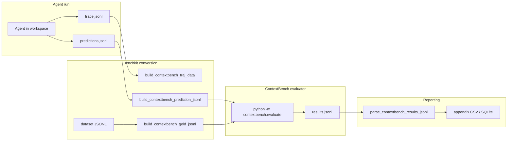

# ContextBench in Benchkit

This document explains what [ContextBench](https://github.com/EuniAI/ContextBench) measures, how those metrics are computed, and how this repository wires ContextBench into the agent benchmark pipeline.

For step-by-step commands (install, export dataset, run agents), see [run-contextbench.md](./run-contextbench.md).

## What ContextBench evaluates

ContextBench scores **context retrieval** for coding agents: how well an agent explores a repository before (and while) editing it, compared to a human-curated **gold context** for each task.

Benchkit runs two independent evaluations per attempt:

| Axis | Question | Source |
|------|----------|--------|
| **Task success** | Did the patch pass the project test harness? | SWE-Bench-style Docker evaluation (same as other benchkit profiles) |
| **Context retrieval** | Did the agent read the right files/lines/symbols? | Upstream `contextbench.evaluate` on the agent trajectory |

A run can **solve** the task with poor retrieval (editing without reading gold files), or achieve high retrieval coverage without solving. Both numbers are useful.

## Gold context vs predicted context

For each instance, ContextBench compares:

- **Gold context** (`gold_ctx` in the dataset): files, line ranges, and symbols a human (or oracle) needed to fix the issue. Merged from `init_ctx` + `add_ctx` where applicable.
- **Predicted context**: everything the agent **retrieved** during the run, derived from tool invocations in `trace.jsonl`.

Coverage and precision are standard set overlaps:

```
coverage  = |gold ∩ pred| / |gold|
precision = |gold ∩ pred| / |pred|
```

Higher coverage means the agent found more of what mattered. Higher precision means less irrelevant reading.

## Metric families

Appendix CSV/JSONL columns are prefixed with `contextbench_`. The raw evaluator JSON is also stored in `evaluator_result` on each per-task row.

### Final context (`contextbench_final_*`)

Snapshot at the **end of the trajectory**: cumulative union of all retrieved files/spans across every step.

| Column suffix | Granularity | Meaning |
|---------------|-------------|---------|
| `file_coverage` / `file_precision` | File paths | Set of repo-relative files |
| `line_coverage` / `line_precision` | Line intervals per file | Merged inclusive line ranges |
| `span_coverage` / `span_precision` | Bytes per file | Byte intervals on disk (tree-sitter / file I/O) |
| `symbol_coverage` / `symbol_precision` | Definitions | Functions/classes inside retrieved spans |

Line metrics are usually the easiest to interpret. Span metrics can differ slightly due to encoding or partial lines. Symbol metrics count tree-sitter definitions in retrieved regions.

The evaluator JSON also includes `intersection`, `gold_size`, and `pred_size` for debugging (e.g. `gold_size: 9` files, `pred_size: 14` files, `intersection: 6`).

### Trajectory efficiency (`contextbench_traj_*`)

Measures **how** context was gathered over time, not only the final union.

**Per-step coverage** (in `evaluator_result.trajectory.steps`): cumulative coverage after each retrieval step. Step 1 is often 0% if the first tool call does not touch gold yet.

| Column | Meaning |
|--------|---------|
| `traj_auc_file`, `traj_auc_symbol`, `traj_auc_span`, `traj_auc_line` | **AUC-Coverage**: average of per-step cumulative coverage across all steps. Rewards finding gold **early**, not only by the last step. |
| `traj_redundancy_file`, `traj_redundancy_symbol`, `traj_redundancy_span`, `traj_redundancy_line` | **Redundancy**: `1 - (unique union size) / (sum of per-step sizes)`. High file redundancy means re-reading the same files; line redundancy stays low if each `sed` window adds new ranges. |

### Edit localization (`contextbench_editloc_*`)

Separate from retrieval. Asks whether **deleted lines in the agent patch** fall inside `init_ctx` line ranges from the dataset.

| Column | Meaning |
|--------|---------|
| `editloc_recall` | Fraction of predicted deletion lines that lie in gold `init_ctx` ranges |
| `editloc_precision` | Same formula in upstream (deletion-line hit rate vs `pred_size`) |

Only **deletions** in `model_patch` are scored. Add-only patches can show `pred_size: 0` and 0% EditLoc even when the fix is correct. Do not treat EditLoc as a second solve metric.

## How benchkit implements ContextBench

### High-level pipeline



### Code layout

| Module | Role |
|--------|------|
| `src/benchkit/contextbench/cli.py` | CLI entry (`plan`, `run`, `export-hf`, `appendix`, `db-import`) — delegates to shared `benchkit.swebench` runners |
| `src/benchkit/contextbench/trajectory.py` | Converts agent tool logs → `traj_data` for the evaluator |
| `src/benchkit/contextbench/evaluation.py` | Builds prediction/gold JSONL; parses evaluator output into flat fields |
| `src/benchkit/swebench/evaluation.py` | Invokes `contextbench.evaluate` after conversion (benchmark `contextbench_verified`) |
| `src/benchkit/swebench/appendix.py` | Maps parsed metrics into `appendix_minimal_per_task_log.csv` |

Upstream evaluator lives in `third_party/ContextBench` (clone required). Config key: `evaluation.contextbench_repo`.

### Benchmark profile

- **Profile name**: `contextbench_verified`
- **Dataset**: exported from Hugging Face `Contextbench/ContextBench` (`contextbench_verified` config) to local JSONL, e.g. `datasets/contextbench_verified.train.jsonl`
- **Instance IDs**: benchkit uses internal IDs (e.g. `SWE-Bench-Verified__python__maintenance__bugfix__2e76c8cd`); evaluation maps to upstream IDs via `original_inst_id` (e.g. `pallets__flask-5014`)

### Per-attempt evaluation flow

After each agent attempt, `benchkit.swebench.evaluation`:

1. Writes `*.contextbench.gold.jsonl` (normalized gold from the dataset row).
2. Reads `trace.jsonl` and `predictions.jsonl` from the attempt directory.
3. Calls `build_contextbench_prediction_jsonl()` → `*.contextbench.predictions.jsonl` with `traj_data` + `model_patch`.
4. Runs (from `third_party/ContextBench`):

   ```bash
   python -m contextbench.evaluate \
     --gold <dataset.jsonl> \
     --pred <converted.predictions.jsonl> \
     --cache <repo checkout cache> \
     --out <results.jsonl>
   ```

5. Parses results with `parse_contextbench_results_jsonl()` into `evaluation.tasks.jsonl` and attempt metadata used by appendix generation.

Preflight checks verify `contextbench_repo` exists and Python dependencies (`tree-sitter`, etc.) import cleanly.

## Trajectory extraction (`build_contextbench_traj_data`)

Benchkit does not require agents to emit a native ContextBench trajectory format. It **reconstructs** retrieval steps from tool invocations stored in trace metadata (`tool_invocations_curated` / `tool_invocations_raw`).

### Primary retrieval tools

Counted as real retrieval steps:

| Tool | Extraction |
|------|------------|
| `read` | `path`, optional `offset` + `limit` → line span |
| `grep` | `path` when present |
| `bash` | Parses `sed -n 'START,ENDp'`, `head`, `tail`, `cat`, trailing path on `rg`/`grep` |

Each invocation with files or spans becomes one step in `pred_steps`. Paths are normalized (strip `/testbed/`, absolute workspace prefixes, etc.) so they match the checked-out repo.

### Edit fallback

If there are **no** primary retrieval invocations (e.g. agent only `Edit` + `WebFetch`), benchkit falls back to **edit-derived** context:

- File from `path` / `filePath`
- Line spans from unified diff hunks in `raw_event.state.metadata.filediff.patch` or `diff`

This is why OpenCode runs with only an `Edit` call can still produce a non-empty trajectory, but often with **zero overlap** against gold.

When both primary retrieval and edits exist, **only primary retrieval** is used for the trajectory (edits are not merged in).

### What is not counted

- `WebFetch`, MCP tools, todo tools, etc.
- Shell commands that do not match the bash patterns above (e.g. `pytest`, `git diff` without readable file spans)

Codex often uses **Bash** with `sed`/`rg`; OpenCode may use `Read`/`Grep` — both can produce valid trajectories if they touch repo files.

## Appendix and database outputs

With `--appendix`, each run writes under `reports/appendix/<run_label>/`:

| File | Contents |
|------|----------|
| `appendix_minimal_per_task_log.csv` | One row per task/attempt: solve status, cost, tokens, all `contextbench_*` columns, `evaluator_result` JSON |
| `appendix_minimal_results_table.md` | Aggregated means for retrieval metrics (when benchmark is `contextbench_verified`) |
| `appendix_tool_invocation_breakdown.md` | Per-call tool sequence |
| `appendix_tool_invocation_log.jsonl` | Raw + curated invocations |

ContextBench runs use a dedicated results table layout (retrieval columns instead of only solve rate). Import into SQLite via:

```bash
python -m benchkit.contextbench.cli db-import \
  --appendix-csv reports/appendix/<run>/appendix_minimal_per_task_log.csv \
  --run-root runs/contextbench_verified/...
```

## Configuration

Example: `configs/contextbench/codex.toml`

```toml
preset = "codex_contextbench"

[run]
dataset_path = "datasets/contextbench_verified.train.jsonl"
benchmark = "contextbench_verified"  # via preset

[evaluation]
contextbench_repo = "third_party/ContextBench"
contextbench_cache_dir = "third_party/ContextBench/repos"

[modes.baseline.agent]
extra_args = []

[modes.with_bitloops.agent]
extra_args = ["--bitloops-init", ...]
```

Modes:

- **`baseline`**: agent only
- **`with_bitloops`**: Bitloops init + DevQL skill (agent may run `bitloops devql query` before `rg`/`sed`)

See `configs/contextbench/README.md` for config file list.

## Interpreting results

### Healthy signals

- **Final line coverage** in the 0.5–1.0 range on multi-file tasks: agent found most gold lines.
- **AUC line** close to final line coverage: gold found early, not only at the end.
- **Low redundancy** on lines: exploratory reads add new ranges instead of repeating the same window.
- **`evaluator_result` without `"error"`**: evaluator completed (checkout + parse succeeded).

### Common caveats

| Observation | Likely cause |
|-------------|----------------|
| 100% coverage + ~3% line precision | Small gold set; agent read a lot of extra code (normal for broad `sed` windows). |
| All retrieval metrics `0` | No primary retrieval and edit fallback missed gold paths, or wrong files edited. |
| EditLoc `0` with `solved` | Patch had no scored deletions, or edits outside `init_ctx` ranges. |
| `status: solved` but pytest failed in trace | Local workspace missing deps; harness runs in Docker. |
| DevQL queries failed | Bitloops/SQLite issue; agent may still score retrieval via bash fallback. |
| `bitloops_context_tokens` empty | Not populated in appendix today; not an eval failure. |

### Comparing baseline vs Bitloops

On the same instance, compare:

- **Final coverage** (did both find gold?)
- **Final precision** and **redundancy** (was Bitloops leaner?)
- **AUC** (did Bitloops find gold sooner?)
- **Solve status** and patch size (harness outcome)

Use the same task ID across runs; gold size differs per instance.

## Related files

- [run-contextbench.md](./run-contextbench.md) — install, export, run commands
- [../configs/contextbench/README.md](../configs/contextbench/README.md) — config paths
- [../third_party/ContextBench/contextbench/evaluate.py](../third_party/ContextBench/contextbench/evaluate.py) — upstream evaluator entrypoint
- [../third_party/ContextBench/contextbench/metrics/compute.py](../third_party/ContextBench/contextbench/metrics/compute.py) — metric definitions
- [../src/benchkit/contextbench/trajectory.py](../src/benchkit/contextbench/trajectory.py) — trajectory reconstruction
- [../tests/test_contextbench.py](../tests/test_contextbench.py) — unit tests for conversion and parsing
